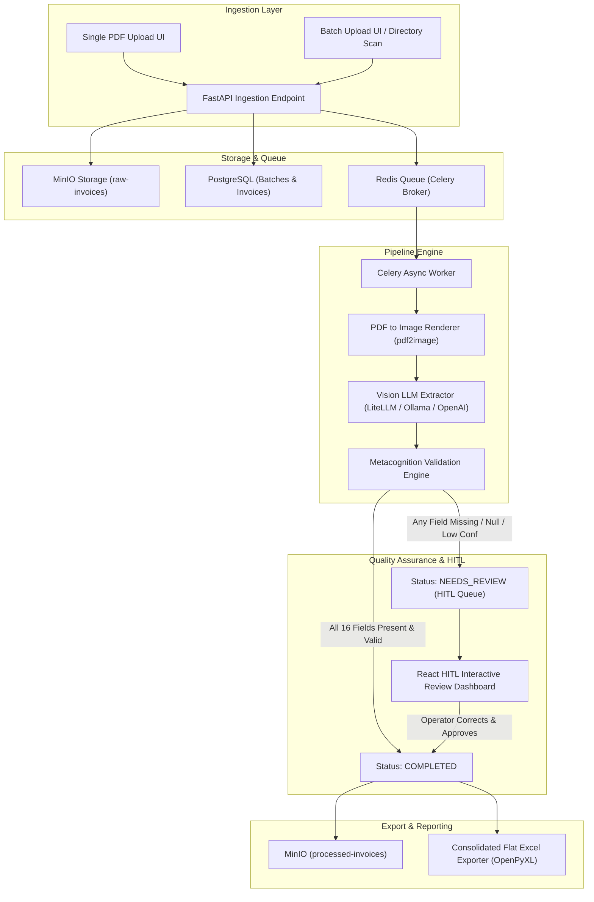

# Implementation Plan: Smart-Invoice-Processor (SIP)

The **Smart-Invoice-Processor (SIP)** is an enterprise-grade, GPU-accelerated / LLM-powered digital invoice processing system inspired by the Receipt-Automation architecture. It automates batch and single PDF invoice ingestion, field extraction using Vision LLMs, field completeness/confidence validation, interactive **Human-In-The-Loop (HITL)** exception resolution, object/relational persistence, and consolidated Excel report generation.

---

## 1. Core Target Schema & Field Requirements

The system processes FBR Digital Invoices and extracts **16 mandatory target fields** divided into **Header** and **Line Item** levels:

| Field # | Field Name | Level | Type | Description | Required for Auto-Approval |
|---|---|---|---|---|---|
| 1 | **FBR Invoice No** | Header | String | Unique FBR Invoice Identifier (e.g., `INV-1029384`) | Yes |
| 2 | **Registration No** | Header | String | Buyer NTN / STRN / Registration Number | Yes |
| 3 | **Business Name** | Header | String | Buyer / Customer Registered Business Name | Yes |
| 4 | **Invoice Date** | Header | Date | Invoice Issue Date (`YYYY-MM-DD`) | Yes |
| 5 | **Insertion Date** | Header | DateTime | System Batch Ingestion Date (`YYYY-MM-DD`) | Yes (auto-populated/extracted) |
| 6 | **Sr. No** | Line Item | Integer | Serial Number of item on invoice | Yes |
| 7 | **HS Code** | Line Item | String | Harmonized System Tariff Code (e.g., `1701.9920`) | Yes |
| 8 | **Product Description** | Line Item | String | Detailed product description | Yes |
| 9 | **Sales Type** | Line Item | String | Sales category (e.g., `3rd Schedule`, `Standard`, `Exempt`) | Yes |
| 10 | **Quantity** | Line Item | Float | Product quantity | Yes |
| 11 | **UoM** | Line Item | String | Unit of Measure (`MT`, `KG`, `PCS`, `BAGS`) | Yes |
| 12 | **Sales Value** | Line Item | Float | Sales value before taxes | Yes |
| 13 | **Retail Price** | Line Item | Float | Retail price per unit or total retail value | Yes |
| 14 | **Sales Tax** | Line Item | Float | Sales tax amount charged | Yes |
| 15 | **Further Tax** | Line Item | Float | Further tax amount charged (0 if N/A) | Yes |
| 16 | **FED** | Line Item | Float | Federal Excise Duty amount charged (0 if N/A) | Yes |

> [!IMPORTANT]
> **HITL Trigger Rule:** If **ANY** header field or line item field is missing, empty, unextracted, below confidence threshold (< 0.85), or structurally unparsable, the document's status MUST be automatically routed to **`NEEDS_REVIEW`** for Human-In-The-Loop verification in the frontend UI.

---

## 2. Architectural Blueprint & Data Flow



---

## 3. High-Level Technical Architecture

### 3.1 Technology Stack
* **Backend Framework:** Python 3.11+, FastAPI (Async API layer), Pydantic v2 (Validation & Schemas).
* **ORM & Database:** Async SQLAlchemy 2.0 + Alembic + PostgreSQL 15.
* **Task Processing & Queue:** Celery + Redis.
* **Object Storage:** MinIO (S3-compatible bucket storage for raw/processed PDFs).
* **AI Vision Extraction:** LiteLLM / Instructor abstraction layer backing OpenAI GPT-4o, Claude 3.5 Sonnet, or Ollama (Qwen2-VL / Qwen3-VL local model).
* **Metacognition Validation Engine:** Rule-based parser verifying presence, format, and numerical balance of all 16 target fields.
* **Frontend Dashboard:** React (Vite + TypeScript + Tailwind CSS + Lucide Icons + PDF Viewer).
* **Export Engine:** Pandas & OpenPyXL for flat Excel spreadsheet generation (repeating Header fields across every line item).

---

## 4. Proposed Directory Structure

```text
Smart-Invoice-Processor/
├── docker-compose.yml
├── docker-compose.prod.yml
├── .env.example
├── README.md
├── PROJECT_PLAN.md
├── schema.sql
├── backend/
│   ├── Dockerfile
│   ├── requirements.txt
│   └── app/
│       ├── __init__.py
│       ├── main.py
│       ├── config.py
│       ├── database.py
│       ├── storage.py                 # MinIO Manager
│       ├── models/
│       │   ├── __init__.py
│       │   └── invoice.py             # SQLAlchemy Header & Line Item models
│       ├── schemas/
│       │   ├── __init__.py
│       │   └── extraction.py          # Pydantic 16-field extraction schemas
│       ├── providers/
│       │   ├── __init__.py
│       │   ├── base_provider.py       # Vision LLM base interface
│       │   ├── litellm_provider.py    # OpenAI / Claude / LiteLLM implementation
│       │   └── ollama_provider.py     # Local GPU Ollama implementation
│       ├── services/
│       │   ├── __init__.py
│       │   ├── metacognition.py       # HITL validation engine (checks missing fields)
│       │   ├── minio_service.py       # S3 storage wrapper
│       │   └── excel_service.py       # Consolidated report exporter
│       ├── tasks/
│       │   ├── __init__.py
│       │   └── celery_worker.py       # Pipeline task execution
│       └── api/
│           ├── __init__.py
│           └── routes.py              # Ingestion, status, HITL, & export endpoints
└── frontend/
    ├── Dockerfile
    ├── package.json
    ├── vite.config.ts
    └── src/
        ├── App.tsx
        ├── main.tsx
        ├── index.css
        ├── components/
        │   ├── FileUpload.tsx         # Single & Batch Drag & Drop zone
        │   ├── BatchTracker.tsx       # Real-time processing progress bar & logs
        │   ├── PDFViewer.tsx          # Canvas/iframe viewer with zoom & rotate
        │   ├── HITLReviewModal.tsx    # Interactive line item editor & header forms
        │   └── InvoiceTable.tsx       # Live preview & search/filter table
        └── views/
            ├── UploadView.tsx         # Ingestion tab
            ├── ReviewView.tsx         # HITL Queue tab
            └── ReportsView.tsx        # Batch Export tab
```

---

## 5. Detailed Component Specifications

### Component 1: Pydantic Extraction Schemas (`backend/app/schemas/extraction.py`)

Defines strict type models enforced on Vision LLM output:

```python
from pydantic import BaseModel, Field
from typing import List, Optional
from datetime import date

class LineItemSchema(BaseModel):
    sr_no: Optional[int] = Field(None, description="Serial Number (Sr. No.)")
    hs_code: Optional[str] = Field(None, description="HS Code (e.g. 1701.9920)")
    product_description: Optional[str] = Field(None, description="Product Description")
    sales_type: Optional[str] = Field(None, description="Sales Type")
    quantity: Optional[float] = Field(None, description="Quantity as numeric value")
    uom: Optional[str] = Field(None, description="Unit of Measure (UoM)")
    sales_value: Optional[float] = Field(None, description="Sales Value")
    retail_price: Optional[float] = Field(None, description="Retail Price")
    sales_tax: Optional[float] = Field(None, description="Sales Tax amount")
    further_tax: Optional[float] = Field(0.0, description="Further Tax amount")
    fed: Optional[float] = Field(0.0, description="FED amount")

class InvoiceHeaderSchema(BaseModel):
    fbr_invoice_no: Optional[str] = Field(None, description="Unique FBR Invoice No")
    registration_no: Optional[str] = Field(None, description="Buyer Registration No / NTN / STRN")
    business_name: Optional[str] = Field(None, description="Buyer Business Name")
    invoice_date: Optional[str] = Field(None, description="Invoice Date (YYYY-MM-DD)")
    insertion_date: Optional[str] = Field(None, description="Insertion Date (YYYY-MM-DD)")
    line_items: List[LineItemSchema] = Field(default_factory=list)
```

---

### Component 2: Metacognition & HITL Engine (`backend/app/services/metacognition.py`)

Evaluates the extracted data against validation rules to determine if human review is necessary.

```python
class MetacognitionEngine:
    MANDATORY_HEADER_FIELDS = ["fbr_invoice_no", "registration_no", "business_name", "invoice_date"]
    MANDATORY_LINE_FIELDS = ["sr_no", "hs_code", "product_description", "sales_type", "quantity", "uom", "sales_value"]

    @classmethod
    def validate_extraction(cls, extracted_data: dict) -> tuple[str, list[str]]:
        """
        Validates extracted invoice data.
        Returns: (status: "COMPLETED" | "NEEDS_REVIEW", missing_reasons: list[str])
        """
        missing_reasons = []

        # 1. Check Header Fields
        for field in cls.MANDATORY_HEADER_FIELDS:
            val = extracted_data.get(field)
            if val is None or str(val).strip() == "" or str(val).strip().lower() in ["null", "none", "n/a"]:
                missing_reasons.append(f"Header field missing: '{field}'")

        # 2. Check Line Items Existence
        line_items = extracted_data.get("line_items", [])
        if not line_items or len(line_items) == 0:
            missing_reasons.append("No line items extracted from invoice")
        else:
            for idx, item in enumerate(line_items):
                for l_field in cls.MANDATORY_LINE_FIELDS:
                    l_val = item.get(l_field)
                    if l_val is None or str(l_val).strip() == "" or str(l_val).strip().lower() in ["null", "none", "n/a"]:
                        missing_reasons.append(f"Line Item #{idx + 1} field missing: '{l_field}'")

        # Determine Final Status
        if len(missing_reasons) > 0:
            return "NEEDS_REVIEW", missing_reasons
        return "COMPLETED", []
```

---

### Component 3: Database ORM Models (`backend/app/models/invoice.py`)

```python
from sqlalchemy import Column, Integer, String, Float, DateTime, ForeignKey, Text, Enum
from sqlalchemy.orm import relationship
from database import Base
import datetime
import enum

class ProcessingStatus(str, enum.Enum):
    PENDING = "PENDING"
    PROCESSING = "PROCESSING"
    COMPLETED = "COMPLETED"
    NEEDS_REVIEW = "NEEDS_REVIEW"
    MANUALLY_VERIFIED = "MANUALLY_VERIFIED"
    FAILED = "FAILED"

class BatchRecord(Base):
    __tablename__ = "batch_records"
    id = Column(String, primary_key=True) # UUID or Timestamp Batch ID
    total_files = Column(Integer, default=0)
    created_at = Column(DateTime, default=datetime.datetime.utcnow)

class InvoiceHeader(Base):
    __tablename__ = "invoice_headers"
    
    id = Column(Integer, primary_key=True, autoincrement=True)
    batch_id = Column(String, ForeignKey("batch_records.id"))
    raw_file_name = Column(String, nullable=False)
    minio_raw_object = Column(String, nullable=False)
    status = Column(String, default=ProcessingStatus.PENDING)
    missing_fields_summary = Column(Text, nullable=True) # JSON list of flags
    
    # 5 Header Fields
    fbr_invoice_no = Column(String, index=True, nullable=True)
    registration_no = Column(String, nullable=True)
    business_name = Column(String, nullable=True)
    invoice_date = Column(String, nullable=True)
    insertion_date = Column(String, nullable=True)
    
    line_items = relationship("InvoiceLineItem", back_populates="header", cascade="all, delete-orphan")

class InvoiceLineItem(Base):
    __tablename__ = "invoice_line_items"
    
    id = Column(Integer, primary_key=True, autoincrement=True)
    invoice_id = Column(Integer, ForeignKey("invoice_headers.id", ondelete="CASCADE"))
    
    # 11 Line Item Fields
    sr_no = Column(Integer, nullable=True)
    hs_code = Column(String, nullable=True)
    product_description = Column(Text, nullable=True)
    sales_type = Column(String, nullable=True)
    quantity = Column(Float, nullable=True)
    uom = Column(String, nullable=True)
    sales_value = Column(Float, nullable=True)
    retail_price = Column(Float, nullable=True)
    sales_tax = Column(Float, nullable=True)
    further_tax = Column(Float, nullable=True, default=0.0)
    fed = Column(Float, nullable=True, default=0.0)
    
    header = relationship("InvoiceHeader", back_populates="line_items")
```

---

### Component 4: Interactive HITL Frontend Review Interface (`frontend/src/views/ReviewView.tsx`)

Features provided in the Human-In-The-Loop review module:
1. **Split-Screen Workspace:** Left pane displays an interactive PDF viewer (zoom, pan, rotation, page navigation). Right pane displays the extracted structured invoice fields.
2. **Missing Field Highlighting:** Fields identified by the `MetacognitionEngine` as missing or null are highlighted with an amber/red border and warning icon.
3. **Dynamic Line Item Editing:** Full inline table allowing operators to edit existing line items, add missing line items, or delete redundant extractions.
4. **Approve & Save:** Submitting manual corrections updates PostgreSQL, transitions the status to `MANUALLY_VERIFIED`, moves the invoice to MinIO `processed-invoices` bucket renamed as `<FBR_INVOICE_NO>.pdf`, and automatically loads the next invoice in the queue.

---

### Component 5: Flat Excel Exporter (`backend/app/services/excel_service.py`)

Outputs a clean 16-column Excel sheet matching financial audit specifications:

```python
import pandas as pd
from openpyxl.styles import Font, PatternFill, Alignment, Border, Side

def generate_flat_excel_report(invoices_data: list[dict]) -> bytes:
    """
    Flattens 1-to-N invoice headers and line items into a single flat DataFrame.
    Fields 1-5 (Header) repeat across every line item record (Fields 6-16).
    """
    flat_rows = []
    
    for inv in invoices_data:
        hdr = {
            "FBR Invoice No": inv.get("fbr_invoice_no", ""),
            "Registration No": inv.get("registration_no", ""),
            "Business Name": inv.get("business_name", ""),
            "Invoice Date": inv.get("invoice_date", ""),
            "Insertion Date": inv.get("insertion_date", "")
        }
        
        items = inv.get("line_items", [])
        if not items:
            # Output header with empty line item fields if no items present
            row = {**hdr, "Sr. No": "", "HS Code": "", "Product Description": "", "Sales Type": "", "Quantity": 0, "UoM": "", "Sales Value": 0, "Retail Price": 0, "Sales Tax": 0, "Further Tax": 0, "FED": 0}
            flat_rows.append(row)
        else:
            for item in items:
                row = {
                    "Sr. No": item.get("sr_no", ""),
                    "FBR Invoice No": hdr["FBR Invoice No"],
                    "Registration No": hdr["Registration No"],
                    "Business Name": hdr["Business Name"],
                    "Invoice Date": hdr["Invoice Date"],
                    "Insertion Date": hdr["Insertion Date"],
                    "HS Code": item.get("hs_code", ""),
                    "Product Description": item.get("product_description", ""),
                    "Sales Type": item.get("sales_type", ""),
                    "Quantity": item.get("quantity", 0),
                    "UoM": item.get("uom", ""),
                    "Sales Value": item.get("sales_value", 0),
                    "Retail Price": item.get("retail_price", 0),
                    "Sales Tax": item.get("sales_tax", 0),
                    "Further Tax": item.get("further_tax", 0),
                    "FED": item.get("fed", 0)
                }
                flat_rows.append(row)

    df = pd.DataFrame(flat_rows)
    # Order columns strictly 1 to 16
    columns_order = [
        "Sr. No", "FBR Invoice No", "Registration No", "Business Name", 
        "Invoice Date", "Insertion Date", "HS Code", "Product Description", 
        "Sales Type", "Quantity", "UoM", "Sales Value", "Retail Price", 
        "Sales Tax", "Further Tax", "FED"
    ]
    df = df[columns_order]
    
    # Export to memory stream with OpenPyXL styling
    # ...
```

---

## 6. Implementation Workflow & Execution Phases

### Phase 1: Environment & Container Infrastructure
1. Configure `docker-compose.yml` for PostgreSQL, Redis, MinIO, FastAPI Backend, Celery Worker, and React Frontend.
2. Initialize MinIO buckets: `raw-invoices` and `processed-invoices`.
3. Set up Alembic migration scripts and PostgreSQL seed schema (`schema.sql`).

### Phase 2: Core Extraction & Metacognition Engine
1. Implement Pydantic 16-field extraction models in `backend/app/schemas/extraction.py`.
2. Implement Vision LLM Service using LiteLLM/OpenAI/Ollama in `backend/app/providers/`.
3. Build the `MetacognitionEngine` rule evaluator in `backend/app/services/metacognition.py` to tag documents missing any of the 16 fields as `NEEDS_REVIEW`.

### Phase 3: Celery Pipeline & API Endpoints
1. Create single-file upload endpoint (`POST /api/v1/invoices/upload-single`).
2. Create batch folder/multi-file ingestion endpoint (`POST /api/v1/invoices/upload-batch`).
3. Build Celery task `process_invoice_pipeline` to orchestrate PDF conversion, LLM extraction, metacognition check, and database storage.

### Phase 4: Human-In-The-Loop (HITL) Dashboard
1. Develop React Frontend with Vite, TypeScript, and Tailwind CSS.
2. Build interactive split-screen PDF review interface (`ReviewView.tsx` & `HITLReviewModal.tsx`).
3. Wire up API endpoint `GET /api/v1/invoices/exceptions` and `PUT /api/v1/invoices/{id}/review` to persist operator corrections and resolve status to `MANUALLY_VERIFIED`.

### Phase 5: Exporting & Verification
1. Implement Excel generator service producing flat 16-column reports (`GET /api/v1/invoices/batch/{batch_id}/export`).
2. Conduct unit and integration tests using sample FBR invoices with missing fields to verify HITL routing.

---

## 7. Verification & Acceptance Criteria

| Scenario | Expected Result | Pass Criteria |
|---|---|---|
| **Single Invoice Upload** | PDF uploaded via UI / API | Status tracked, processed asynchronously, saved in MinIO & Postgres |
| **Batch Ingestion (10-100 PDFs)** | Multi-file drop or directory scan | Batch ID generated, multi-worker Celery queue progress rendered live |
| **All Fields Extracted Cleanly** | Invoice with complete header & line items | Auto-approved, status set to `COMPLETED`, PDF moved to `processed-invoices` |
| **Missing Field (e.g. HS Code / Tax)** | Invoice missing mandatory field | Status set to `NEEDS_REVIEW`, routed to HITL queue with alert badges |
| **HITL Operator Correction** | Operator fills in missing fields in Review UI | Changes saved, status updated to `MANUALLY_VERIFIED`, queued item resolved |
| **Consolidated Excel Export** | Click "Export Excel" button | Flat 16-column `.xlsx` downloaded with repeated header fields per line item |

---

## 8. Open Questions for Review

1. **AI Provider Choice:** Do you prefer using cloud Vision LLMs (e.g., OpenAI `gpt-4o` / Anthropic `claude-3-5-sonnet`) or a local GPU-accelerated Ollama model (e.g., `qwen2-vl:7b` / `qwen3-vl:8b`)?
2. **MinIO Persistence:** Should processed PDFs in MinIO be renamed to `<FBR_INVOICE_NO>.pdf` immediately or only after HITL approval if the FBR number was initially missing?
